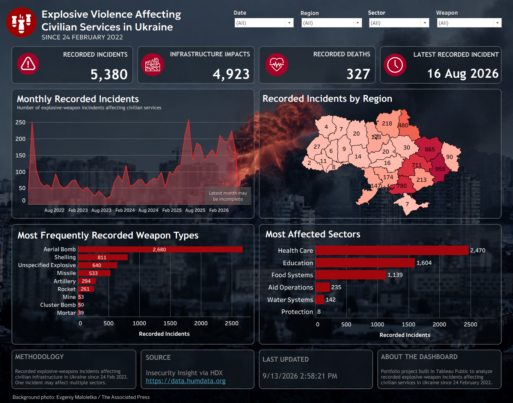
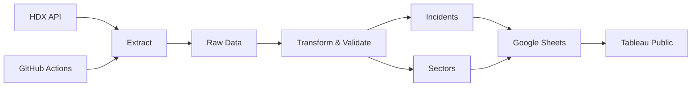

# Explosive Violence Affecting Civilian Services in Ukraine


A data analysis project exploring recorded explosive-weapon incidents affecting civilian services in Ukraine since 24 February 2022.

I originally started this as a Python + Tableau analysis project. While working with the data, I decided to take it a step further and build a small automated pipeline around it, so the project would not depend on manually downloading and replacing files every time the source is updated. 

**So now the underlying data pipeline is refreshed automatically once a week.**

**Data source:** [Insecurity Insight via the Humanitarian Data Exchange (HDX)](https://data.humdata.org/dataset/explosive-weapons-use-affecting-aid-access-education-and-healthcare-services)

### [View the interactive Tableau dashboard](https://public.tableau.com/views/Book1_17807567395660/Dashboard_Explosive_Violence?:language=en-US&publish=yes&:sid=&:redirect=auth&:display_count=n&:origin=viz_share_link)



---

## What the dashboard looks at

The dashboard focuses on a few simple questions:

- How has the number of recorded incidents changed over time?
- Which regions appear most often in the data?
- Which explosive weapon types are most frequently recorded?
- Which civilian sectors are most affected?
- How many deaths and infrastructure impacts are recorded in the dataset?

The current analysis covers recorded incidents in Ukraine from **24 February 2022 onward**.

---

## How the project works

The project now follows a simple ETL workflow:



In practice:

```text
HDX
 ↓
Python extraction
 ↓
Cleaning + transformation
 ↓
Data quality checks
 ↓
Google Sheets
 ↓
Tableau Public
```

GitHub Actions runs the Python pipeline automatically, so the data can be refreshed without running the project from my local machine.

---

## Some of the decisions behind the analysis

A surprisingly large part of this project beside code was deciding what the data actually meant.

### Geography

The original geographic fields were not completely consistent. Some records contained oblast names, some used districts, and some locations were ambiguous.

Instead of applying one broad rule to every record, I:

- standardized known region names
- mapped reliable district-to-oblast cases
- manually reviewed ambiguous events
- kept unresolved records as `unknown` rather than forcing a potentially wrong location

The cleaned field is stored separately as `region_clean`, so the original source value is preserved.

### Multi-sector incidents

One incident can affect more than one sector.

For example, a single event may affect both **Health Care** and **Education**.

Putting those values into a single flat table would either make the analysis awkward or duplicate incident-level metrics. I therefore created a second table:

```text
incidents
1 row = 1 incident

sectors
1 row = 1 incident-sector combination
```

The two tables are related by:

```text
sind_event_id
```

This allows Tableau to analyse sectors without inflating incident counts, recorded deaths, or infrastructure impacts.

### Infrastructure impacts

Some source fields describe whether a type of infrastructure was recorded as damaged or destroyed.

For those fields, I treat the presence of a recorded impact as an indicator:

```text
1 = this type of infrastructure impact was recorded
0 = it was not recorded
```

So `infrastructure_total` should be interpreted as a count of **recorded infrastructure impact indicators**, not as a verified number of individual buildings or facilities.

### Recorded deaths

`recorded_deaths` is calculated from the relevant death fields available in the source dataset.

I deliberately call this metric **Recorded Deaths** rather than “Total Deaths” because it only reflects deaths represented in the available source fields.

---

## Data quality checks

Before processed data is saved or uploaded, the pipeline checks several assumptions that the dashboard depends on.

Among other things, it checks that:

- incident IDs are unique in the main table
- required analytical fields are present
- region values belong to the expected set
- every incident is represented in the sector table
- duplicate incident-sector pairs do not exist

If one of these checks fails, the pipeline raises an error instead of updating the dashboard with potentially incorrect data.

That was an important part of the project for me: automation is useful only if bad data does not get automated along with everything else.

---

## Automation

The main entry point is:

```text
pipeline.py
```

It runs:

```text
Extract → Transform → Validate → Load
```

The GitHub Actions workflow then:

1. starts a clean Ubuntu runner
2. checks out the repository
3. installs Python and project dependencies
4. runs `pipeline.py`
5. downloads the current HDX dataset
6. rebuilds the processed tables
7. uploads them to Google Sheets

Google service-account credentials are stored as a GitHub repository secret and are never committed to the repository.

The workflow can also be triggered manually from the **Actions** tab.

---

## Repository structure

```text
.
├── .github/
│   └── workflows/
│       └── update_data.yml
│
├── assets/
│   └── dashboard.png
│
├── explosive_weapon_raw.xlsx
├── extract.py
├── transform.py
├── transform.ipynb
├── load.py
├── pipeline.py
├── requirements.txt
└── .gitignore
```

`extract.py` — retrieves the source dataset from HDX  
`transform.py` — cleaning, feature creation and validation  
`transform.ipynb` — exploratory work behind the transformation logic  
`load.py` — uploads processed tables to Google Sheets  
`pipeline.py` — runs the complete workflow

The raw Excel file is included as a snapshot of the source data used during development. The automated pipeline downloads the latest available version when it runs.

---

## Tools used

**Python · Pandas · Requests · Tableau Public · Google Sheets API · GitHub Actions · HDX / CKAN API**

---

## Notes

This dashboard represents **recorded incidents available in the source dataset**. It should not be interpreted as a complete record of all explosive violence, casualties, or infrastructure damage in Ukraine.

The project was built as a portfolio project to practice not only analysis and visualization, but also the less visible parts of data work: defining metrics, handling ambiguous data, validating assumptions, modelling multi-value relationships, and automating repeatable workflows.